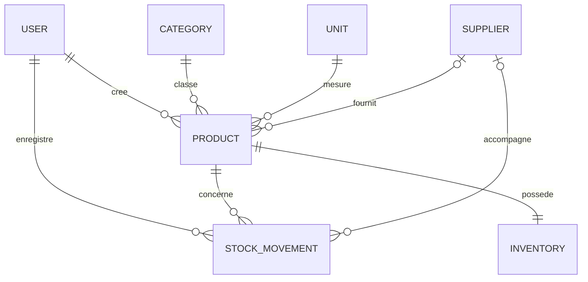

# Modèle de données PostgreSQL / Prisma — Rozi V1

## Principes

- Les identifiants sont des UUID.
- Les quantités utilisent trois décimales afin d'accepter les pièces entières mais aussi les mètres, litres et kilogrammes.
- Les prix sont stockés en unités monétaires mineures (centimes) pour éviter les erreurs d'arrondi.
- Un produit et un utilisateur sont désactivés au lieu d'être supprimés lorsqu'ils sont déjà référencés dans l'historique.
- `Inventory.quantity` est le stock courant rapide à lire.
- `StockMovement` est le journal immuable qui explique chaque variation.
- Les deux sont toujours mis à jour ensemble dans une transaction.

## Schéma Prisma proposé

```prisma
generator client {
  provider = "prisma-client-js"
}

datasource db {
  provider = "postgresql"
  url      = env("DATABASE_URL")
}

enum UserRole {
  ADMIN
  EMPLOYEE
}

enum MovementType {
  IN
  OUT
  ADJUSTMENT
}

enum MovementReason {
  INITIAL_STOCK
  PURCHASE
  SALE
  INTERNAL_USE
  DAMAGED
  LOSS
  SUPPLIER_RETURN
  INVENTORY_CORRECTION
  OTHER
}

model User {
  id            String          @id @default(uuid()) @db.Uuid
  username      String          @unique @db.VarChar(80)
  email         String?         @unique @db.VarChar(255)
  name          String          @db.VarChar(160)
  passwordHash  String
  role          UserRole        @default(EMPLOYEE)
  isActive      Boolean         @default(true)
  lastLoginAt   DateTime?
  createdAt     DateTime        @default(now())
  updatedAt     DateTime        @updatedAt
  movements     StockMovement[]
  auditLogs     AuditLog[]
  createdProducts Product[]     @relation("ProductCreator")

  @@index([role, isActive])
  @@map("users")
}

model Category {
  id          String    @id @default(uuid()) @db.Uuid
  name        String    @unique @db.VarChar(100)
  description String?
  isActive    Boolean   @default(true)
  createdAt   DateTime  @default(now())
  updatedAt   DateTime  @updatedAt
  products    Product[]

  @@index([isActive])
  @@map("categories")
}

model Unit {
  id        String    @id @default(uuid()) @db.Uuid
  name      String    @unique @db.VarChar(80)
  symbol    String    @db.VarChar(20)
  decimals  Int       @default(0)
  isActive  Boolean   @default(true)
  createdAt DateTime  @default(now())
  updatedAt DateTime  @updatedAt
  products  Product[]

  @@index([isActive])
  @@map("units")
}

model Supplier {
  id          String          @id @default(uuid()) @db.Uuid
  name        String          @unique @db.VarChar(160)
  phone       String?         @db.VarChar(40)
  email       String?         @db.VarChar(255)
  address     String?
  isActive    Boolean         @default(true)
  createdAt   DateTime        @default(now())
  updatedAt   DateTime        @updatedAt
  products    Product[]
  movements   StockMovement[]

  @@index([isActive])
  @@map("suppliers")
}

model Product {
  id                 String          @id @default(uuid()) @db.Uuid
  name               String          @db.VarChar(180)
  sku                String          @unique @db.VarChar(80)
  barcode            String?         @unique @db.VarChar(100)
  description        String?
  imageUrl           String?
  alertThreshold     Decimal         @default(0) @db.Decimal(18, 3)
  purchasePriceMinor Int?
  salePriceMinor     Int?
  currency           String          @default("EUR") @db.Char(3)
  isActive           Boolean         @default(true)
  categoryId         String          @db.Uuid
  unitId             String          @db.Uuid
  supplierId         String?         @db.Uuid
  createdById        String          @db.Uuid
  createdAt          DateTime        @default(now())
  updatedAt          DateTime        @updatedAt

  category           Category        @relation(fields: [categoryId], references: [id], onDelete: Restrict)
  unit               Unit            @relation(fields: [unitId], references: [id], onDelete: Restrict)
  supplier           Supplier?       @relation(fields: [supplierId], references: [id], onDelete: SetNull)
  createdBy          User            @relation("ProductCreator", fields: [createdById], references: [id], onDelete: Restrict)
  inventory          Inventory?
  movements          StockMovement[]

  @@index([name])
  @@index([categoryId, isActive])
  @@index([supplierId])
  @@map("products")
}

model Inventory {
  id        String   @id @default(uuid()) @db.Uuid
  productId String   @unique @db.Uuid
  quantity  Decimal  @default(0) @db.Decimal(18, 3)
  version   Int      @default(0)
  updatedAt DateTime @updatedAt

  product   Product  @relation(fields: [productId], references: [id], onDelete: Restrict)

  @@map("inventories")
}

model StockMovement {
  id           String          @id @default(uuid()) @db.Uuid
  productId    String          @db.Uuid
  userId       String          @db.Uuid
  supplierId   String?         @db.Uuid
  type         MovementType
  reason       MovementReason
  quantity     Decimal         @db.Decimal(18, 3)
  delta        Decimal         @db.Decimal(18, 3)
  stockBefore  Decimal         @db.Decimal(18, 3)
  stockAfter   Decimal         @db.Decimal(18, 3)
  reference    String?         @db.VarChar(120)
  customerName String?         @db.VarChar(160)
  comment      String?
  occurredAt   DateTime
  createdAt    DateTime        @default(now())

  product      Product         @relation(fields: [productId], references: [id], onDelete: Restrict)
  user         User            @relation(fields: [userId], references: [id], onDelete: Restrict)
  supplier     Supplier?       @relation(fields: [supplierId], references: [id], onDelete: SetNull)

  @@index([productId, occurredAt(sort: Desc)])
  @@index([type, occurredAt(sort: Desc)])
  @@index([userId, occurredAt(sort: Desc)])
  @@index([occurredAt(sort: Desc)])
  @@map("stock_movements")
}

model AuditLog {
  id         String   @id @default(uuid()) @db.Uuid
  userId     String?  @db.Uuid
  action     String   @db.VarChar(100)
  entityType String   @db.VarChar(80)
  entityId   String?  @db.Uuid
  metadata   Json?
  createdAt  DateTime @default(now())

  user       User?    @relation(fields: [userId], references: [id], onDelete: SetNull)

  @@index([entityType, entityId])
  @@index([createdAt(sort: Desc)])
  @@map("audit_logs")
}
```

## Contraintes PostgreSQL complémentaires

Prisma ne décrit pas toutes les contraintes métier. La migration SQL ajoutera :

```sql
ALTER TABLE "inventories"
  ADD CONSTRAINT "inventories_quantity_non_negative"
  CHECK ("quantity" >= 0);

ALTER TABLE "products"
  ADD CONSTRAINT "products_alert_threshold_non_negative"
  CHECK ("alertThreshold" >= 0);

ALTER TABLE "products"
  ADD CONSTRAINT "products_purchase_price_non_negative"
  CHECK ("purchasePriceMinor" IS NULL OR "purchasePriceMinor" >= 0);

ALTER TABLE "products"
  ADD CONSTRAINT "products_sale_price_non_negative"
  CHECK ("salePriceMinor" IS NULL OR "salePriceMinor" >= 0);

ALTER TABLE "stock_movements"
  ADD CONSTRAINT "stock_movements_quantity_positive"
  CHECK ("quantity" > 0);

ALTER TABLE "stock_movements"
  ADD CONSTRAINT "stock_movements_stock_non_negative"
  CHECK ("stockBefore" >= 0 AND "stockAfter" >= 0);

ALTER TABLE "units"
  ADD CONSTRAINT "units_decimals_range"
  CHECK ("decimals" BETWEEN 0 AND 3);
```

## Relations



## Valeurs initiales

Les données de départ seront ajoutées par un seed séparé :

- catégories : Ciment, Peinture, Électricité, Plomberie, Visserie, Outillage, Bois, Serrurerie, Matériaux, Autres ;
- unités : pièce, carton, sac, boîte, mètre, kilogramme, litre, rouleau, paquet ;
- premier administrateur créé à partir de variables d'environnement, jamais avec un mot de passe écrit dans le dépôt.

## Pourquoi conserver Inventory et StockMovement ?

Le journal des mouvements permet l'audit et la reconstruction du stock. La table Inventory évite de recalculer tout l'historique à chaque affichage. Leur cohérence est garantie par une transaction et testée automatiquement.

Une vérification d'intégrité pourra comparer périodiquement :

`Inventory.quantity = somme des StockMovement.delta du produit`.
